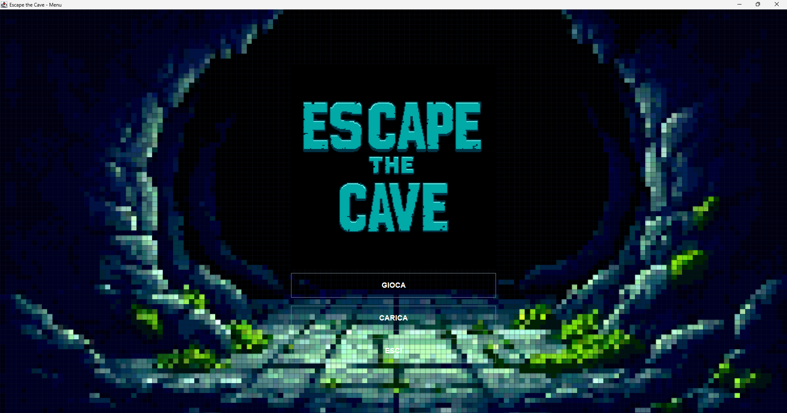
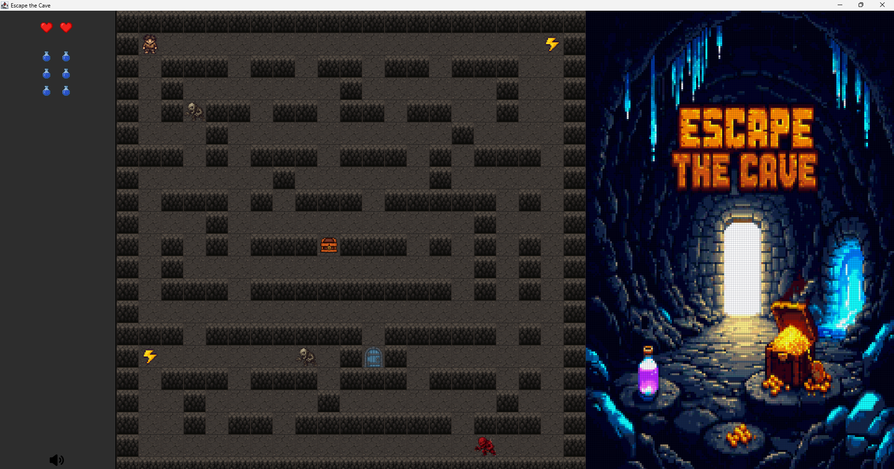

# 🧠 Escape-The-Cave: A Java-Based Adventure Game
Escape-The-Cave is a Java-based adventure game where players navigate through a cave, avoiding obstacles and enemies to reach the exit. The game features a graphical user interface (GUI) with a main menu, game area, and sidebar. The game logic is handled by the `Videogioco` class, which provides a foundation for the game's mechanics, including player movement, monster movement, and game state management.

## 🚀 Features
* Graphical user interface (GUI) with a main menu, game area, and sidebar
* Game logic handled by the `Videogioco` class
* Player movement and monster movement
* Game state management, including pausing and resuming the game
* Audio playback for menu music and game sound effects
* Support for loading saved games

## 🛠️ Tech Stack
* Java 8 or later
* Java Swing for GUI components
* Java AWT for graphics and layouts
* Java Util for utility classes, such as `ArrayList` and `Random`
* Custom classes for game logic, GUI components, and audio playback

## 📦 Installation
To install the game, follow these steps:
1. Clone the repository using Git: `git clone https://github.com/your-username/Escape-The-Cave.git`
2. Navigate to the project directory: `cd Escape-The-Cave`
3. Compile the Java code: `javac core/*.java model/*.java gui/*.java`
4. Run the game: `java core.Main`

## 💻 Usage
To play the game, follow these steps:
1. Run the game using the command `java core.Main`
2. Select a map from the main menu
3. Start the game by clicking the "Gioca" button
4. Use the arrow keys to move the player
5. Avoid obstacles and enemies to reach the exit

## 📂 Project Structure
```
Escape-The-Cave/
├── core/
│   ├── Main.java
│   ├── Videogioco.java
├── model/
│   ├── BaseEntita.java
│   ├── Caverna.java
│   ├── Prigioniero.java
├── gui/
│   ├── MenuPrincipale.java
│   ├── GiocoGUI.java
├── resources/
│   ├── audio/
│   ├── images/
```

## 📸 Screenshots

### Main Menu


### Gameplay

